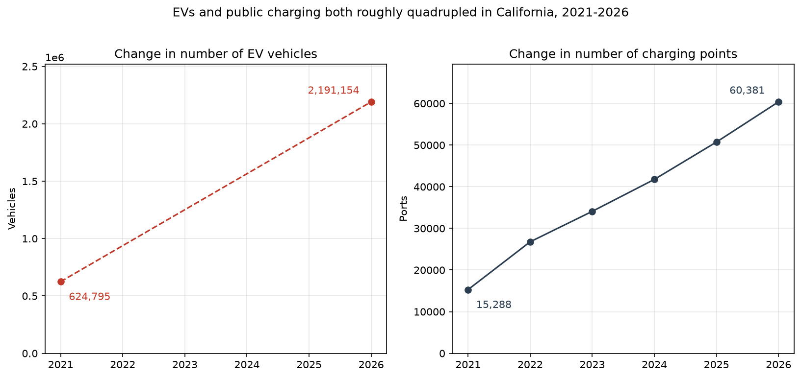
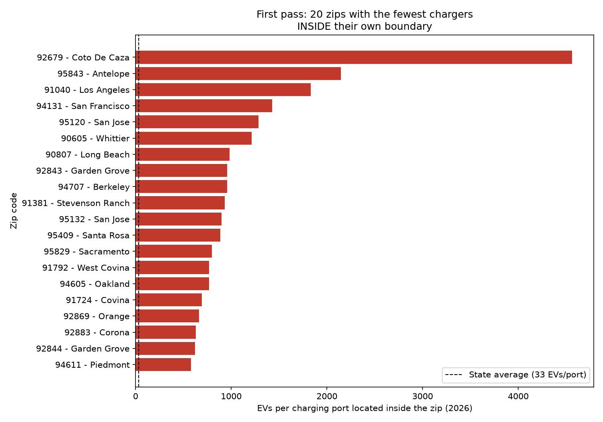
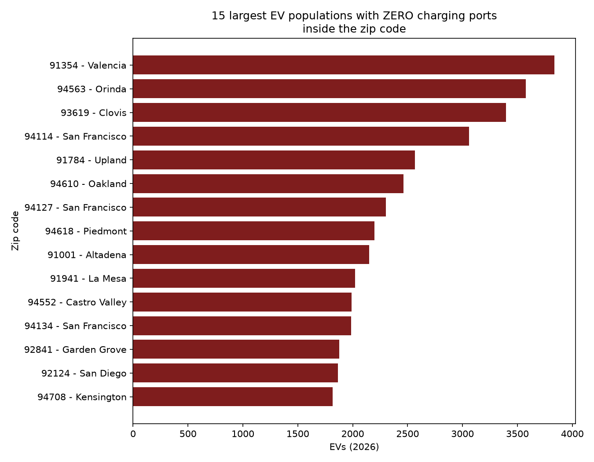
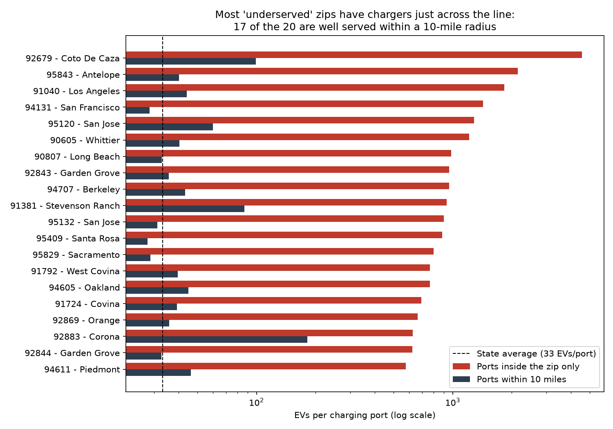
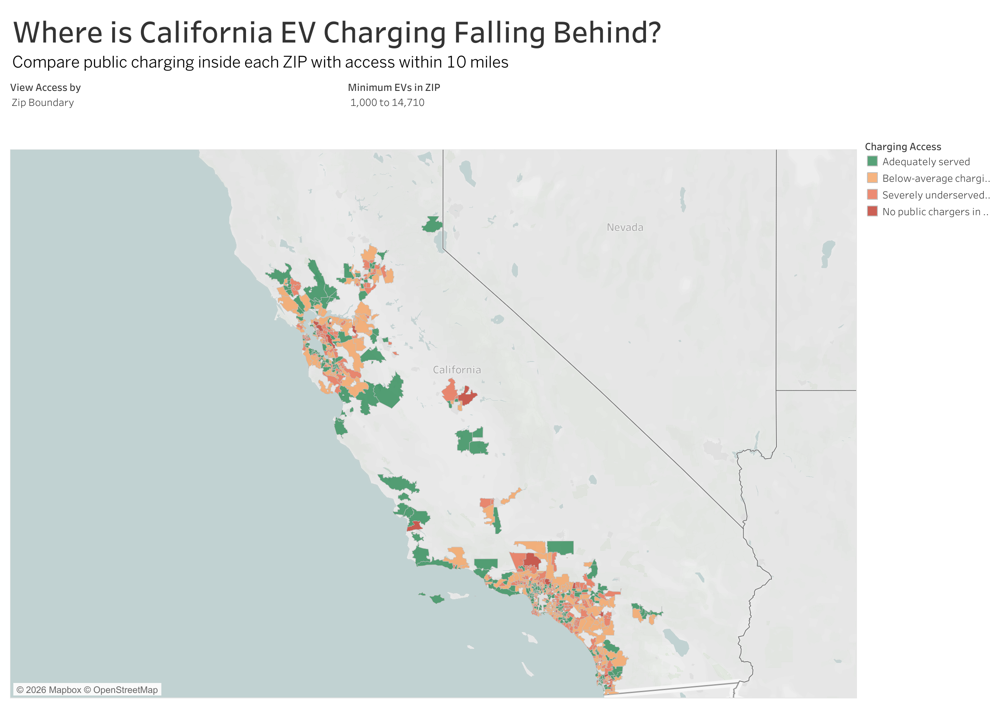

# California EV Charging Gap Analysis

## Research question

**Which California zip codes have the largest gap between EV adoption and public charging capacity — and where should the next public chargers be built?**

California added more than 1.5 million electric vehicles between 2021 and 2026. This project measures whether public charging kept up, finds the neighborhoods where it did not, and — importantly — corrects a flaw in its own first answer.

---

## The data

Three raw files, all publicly available:

| File | Source | What it contains |
|---|---|---|
| `zip2021.csv` | CA DMV, via data.ca.gov | Vehicle registrations as of 1/1/2021 by zip code, fuel type, make, model year, and duty class (~678,000 rows) |
| `zip2025.csv` | CA DMV, via data.ca.gov | The same file for the 1/1/2026 snapshot (~504,000 rows) |
| `altfuelstation.csv` | U.S. Dept. of Energy, AFDC | Every public electric charging station in California — location, coordinates, port counts by charger type, network, and open date (~20,300 rows) |

Two reference files were added later: `zip_city.csv` (zip → city and county) for labels and county rollups, and `uszips.csv` (zip → center coordinates) for the distance analysis.

The DMV files are the **demand** side: how many EVs live in each zip code. The AFDC file is the **supply** side: how many public charging ports exist, and exactly where.

<details>
<summary><b>Reproducing this project</b></summary>

Raw data is not committed to this repo. Download into `ev_data/ev_raw/` using these filenames:

- CA DMV "Vehicle Fuel Type Count by Zip Code" (1/1/2021 and 1/1/2026 snapshots) → `zip2021.csv`, `zip2025.csv`
- AFDC station data, filtered to Electric / California / Public / All statuses → `altfuelstation.csv`
- Zip → city/county reference:
  ```bash
  curl -L "https://raw.githubusercontent.com/scpike/us-state-county-zip/master/geo-data.csv" -o ev_data/ev_raw/zip_city.csv
  ```
- Zip center coordinates: the free US Zip Codes Database from simplemaps.com/data/us-zips → `uszips.csv`

Then run the scripts in order: `02` → `03` → `04` → `05` → `06` → `07`.
</details>

---

## Data cleaning

All cleaning is done in SQL using DuckDB (`02_clean.py`), which queries the raw CSVs directly. Every filter is applied in code rather than at the download step, so each exclusion is visible and reproducible.

**Defining supply.** Stations were kept only if they are open (`Status Code = 'E'`) and sit in a valid 5-digit California zip code (checked with a regex and the 90001–96162 range, which removes malformed and out-of-state values). Missing port counts became zeros, since a blank in the AFDC file means "no ports of this type," not "unknown." Ports at stations that opened before 1/1/2021 were summed separately to reconstruct historical supply.

**Defining demand.** Registrations were filtered to light-duty (passenger) vehicles with a fuel type of Battery Electric or Plug-in Hybrid. Each raw row is a count of vehicles for a zip/year/make/fuel combination, so vehicle counts were summed rather than rows counted.

**Joining.** Both sources were aggregated to one row per zip, then combined with full joins so a zip appearing in any source survives — critical, since zips with EVs and no chargers are the cases that matter most. Missing values from either side were filled with zeros.

| After cleaning | Count |
|---|---|
| Open public charging stations | 19,855 |
| Public charging ports | 65,845 (47,607 Level 2 · 18,238 DC fast) |
| EVs, 2021 | 624,795 |
| EVs, 2026 | 2,191,154 |
| Zip codes in final table | 2,436 |

---

## Finding 1: statewide, charging supply kept pace with demand



Both sides of the market grew at nearly the same rate. EVs grew 3.5× (624,795 → 2,191,154) while public charging ports grew 4.0× (15,288 → 60,381, measured as of January 1 each year). Crowding actually eased slightly: about **41 EVs per public port in 2021 versus 36 in 2026**.

So California is not suffering a statewide charger shortage. If there is a problem, it is a problem of *distribution* — which is what the rest of this analysis tests.

---

## Finding 2 (first pass): some zip codes look catastrophically underserved

The obvious next step is to compare each zip's EV count against the chargers located inside that zip. Against a statewide average of 33 EVs per port, the results looked alarming:



Zip 92679 (Coto de Caza, Orange County) has 4,563 EVs and **one** charging port inside its boundary — 137 times the state average. Thirty-one zip codes with more than 1,000 EVs have no ports inside them at all, including dense San Francisco neighborhoods and fast-growing Southern California suburbs.



On this basis, 34 zip codes ranked among the 50 worst in California on both current supply and growth since 2021. That was the project's provisional answer.

---

## The turn: the first answer was measuring the wrong thing

> ### A zip code boundary is not a barrier.
> Checking the worst result against a map showed the problem immediately: residents of Coto de Caza can reach chargers in Rancho Santa Margarita or Foothill Ranch in about ten minutes. **The metric was counting chargers inside an administrative line rather than chargers a driver can actually reach** — a textbook case of the modifiable areal unit problem, where the answer depends on where the boundaries happen to fall.

`04_radius_access.py` re-tests every zip on a fairer basis. Using station coordinates and zip center points, it counts every port within **10 miles** — and every EV within those same 10 miles, since nearby drivers compete for the same chargers.



The correction is dramatic. **Eighteen of the twenty "worst" zip codes are comfortably served once neighboring supply is counted.** Coto de Caza falls from 4,563 EVs per port to 63 — it has 1,105 ports within ten miles. Only two of the original twenty survive as genuinely underserved.

Across all zip codes with at least 1,000 EVs:

| Access class | Zip codes |
|---|---|
| Well served on both measures | 399 |
| Locally sparse — but chargers within 10 miles | 263 |
| Locally fine — but the wider area is crowded | 19 |
| **Isolated — underserved on both measures** | **47** |

---

## Finding 3: how much of the inequality is real?

`07_disparity.py` measures how evenly charging is distributed relative to where EVs are, using the **Gini coefficient** — the same statistic used for income inequality, where 0 means perfectly proportional and 1 means everything sits in one place. Computing it at three geographic scales isolates how much of the apparent gap is genuine:

| How access is measured | Gini |
|---|---|
| Ports inside each zip code | **0.575** |
| Ports within 10 miles of each zip | **0.206** |
| Ports within each county | **0.170** |

The gap between the first two rows is the boundary effect, quantified. Measured by administrative line, charging access looks more unequal than income in most countries. Measured by what drivers can actually reach, most of that inequality dissolves.

> **The honest conclusion: California's charging problem is smaller and more specific than the raw zip-level numbers suggest — but it is not zero.** A residue of 47 zip codes stays underserved no matter how the boundary is drawn, and those are where investment belongs.

---

## Interactive map: the gap, zip code by zip code

To make the results easier to explore, I built an interactive Tableau dashboard that maps charging access across California zip codes. The **View Access by** control switches between the original **ZIP Boundary** measure and the corrected **10-Mile Access** measure, while the **Minimum EVs in ZIP** filter lets users focus on areas with meaningful EV demand. Hovering over a zip shows its EV count, charging ports inside the zip, charging ports within 10 miles, and the corresponding access metrics.



**[Explore the interactive dashboard on Tableau Public →](https://public.tableau.com/shared/J7BC5YWDB?:display_count=n&:origin=viz_share_link)**

The dashboard makes the boundary effect visible: many zip codes that appear underserved when only chargers inside the zip are counted become adequately served once nearby charging infrastructure is included, while the areas that remain red are the places with a more persistent access gap.

---

## Recommendation

**47 zip codes are underserved whether access is measured inside the zip or within a 10-mile radius.** These are the defensible targets for new public charging investment.

The ten most acute, ranked by EVs per port within reach:

| Zip | Area | EVs | Ports inside | Ports within 10 mi | EVs per port nearby |
|---|---|---|---|---|---|
| 91390 | Santa Clarita | 1,487 | 0 | 27 | 422 |
| 91042 | Tujunga | 2,187 | 8 | 83 | 349 |
| 92883 | Corona | 3,762 | 6 | 92 | 201 |
| 92545 | Hemet | 1,022 | 5 | 63 | 193 |
| 95037 | Morgan Hill | 5,393 | 61 | 71 | 182 |
| 92881 | Corona | 2,296 | 32 | 192 | 132 |
| 92596 | Winchester | 2,876 | 23 | 163 | 123 |
| 92882 | Corona | 3,635 | 45 | 261 | 118 |
| 92879 | Corona | 2,040 | 21 | 293 | 116 |
| 92585 | Menifee | 1,523 | 0 | 158 | 116 |

<details>
<summary>All 47 zip codes</summary>

`91042, 91304, 91350, 91354, 91381, 91384, 91387, 91390, 91708, 91739, 91913, 91915, 92029, 92064, 92128, 92399, 92532, 92545, 92585, 92596, 92629, 92673, 92675, 92677, 92694, 92808, 92879, 92880, 92881, 92882, 92883, 92887, 93536, 94505, 94507, 94521, 94526, 94531, 94549, 94550, 94578, 94595, 95037, 95135, 95138, 95377, 95391`
</details>

The pattern is geographic rather than random: the list clusters in the Inland Empire (Corona, Hemet, Winchester, Menifee), the Santa Clarita Valley, and the outer edges of the Bay Area — fast-growing exurbs where EV adoption arrived before charging infrastructure did.

---

## Limitations

- **Distance is straight-line, not drive time.** Ten miles across a ridge or a bay is not a ten-minute drive, so some zips classified as "locally sparse" may be less convenient than they appear.
- **Charging supply reflects the DOE/AFDC registry.** Commercial databases list additional chargers (destination chargers, private garages, some workplace units), so absolute counts may understate real supply.
- **Home charging is not measured.** Public port scarcity matters far more to renters and apartment dwellers than to homeowners with a garage outlet. Two zips with identical ratios can face very different real-world problems.
- **Historical port counts are reconstructed from station open dates**, so stations that have since closed are missing, making measured port growth an upper estimate. 26 open stations have no recorded open date.
- **EV registrations exist only as two snapshots** (2021 and 2026), so growth is measured between endpoints rather than as a continuous trend.
- **Coverage gaps in reference files.** 715 zip codes (0.4% of EVs) have no center point and are excluded from the distance analysis; 798 (about 4% of EVs) have no county match and are excluded from the county rollup only.
- **Registration location is not charging location.** Vehicles are counted where they are registered, which does not capture commuting or highway-corridor demand.

## Future work

- Replace straight-line distance with drive-time isochrones, which would sharpen the "locally sparse" classification considerably.
- Add Census data (median household income, renter share) to weight demand by who actually depends on public charging, and to test whether investment tracks income.
- Apply a two-step floating catchment area model, the standard approach in healthcare-access research, to handle supply and competition more rigorously.
- Extend the method to a second state with comparable public registration data (e.g. Washington).

---

## Repository structure

```
ev-charging-analysis/
├── ev_data/
│   ├── ev_raw/                 # source CSVs (not committed — see above)
│   └── processed/              # cleaned outputs
├── figures/                    # charts used in this README
├── 01_explore.py               # load raw files, inspect columns and nulls
├── 02_clean.py                 # SQL cleaning and aggregation (DuckDB)
├── 03_analysis.py              # first pass: chargers inside each zip
├── 04_radius_access.py         # correction: chargers within 10 miles
├── 05_visuals.py               # charts, including the before/after comparison
├── 06_tableau_export.py        # map-ready table for Tableau
└── 07_disparity.py             # Gini coefficient at three geographic scales
```

**Tools:** Python (pandas, NumPy, matplotlib), SQL (DuckDB), Tableau Public, Git.
